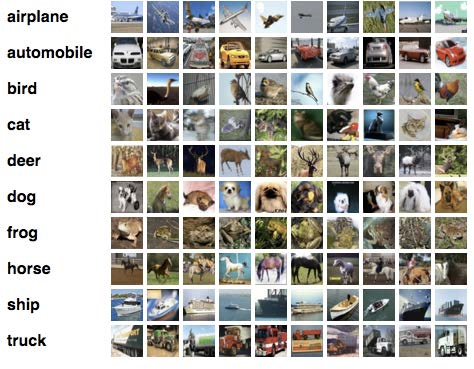
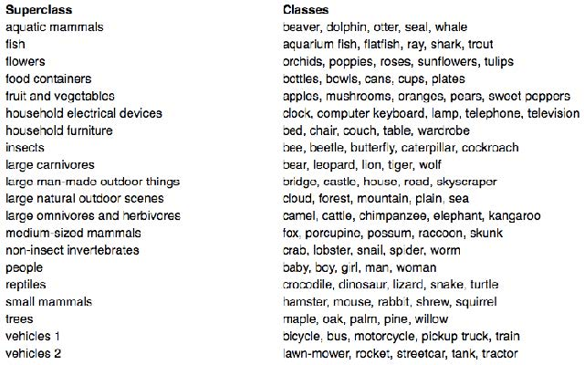
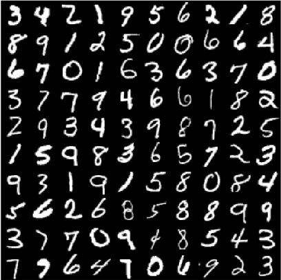
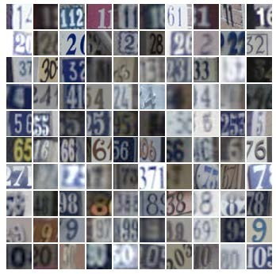
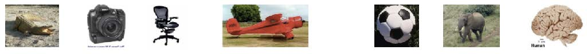
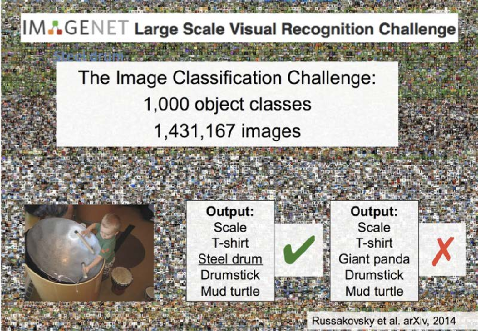

# Image Datasets
## CIFAR-10
[The CIFAR-10 dataset](https://www.cs.toronto.edu/~kriz/cifar.html)  

  

10 classes, 50,000 training images, 10,000 test images, 32 * 32 * 3 images

## CIFAR-100
[The CIFAR-100 dataset](https://www.cs.toronto.edu/~kriz/cifar.html)  

  

100 classes, 50,000 training images, 10,000 test images, 32 * 32 * 3 images

## MNIST
[The MNIST dataset](http://yann.lecun.com/exdb/mnist/)  

  

10 classes, 60,000 training images, 10,000 test images, 28 * 28 images

## SVHN(Street View House Numbers)
[The SVHN dataset](http://ufldl.stanford.edu/housenumbers/)  

  

10 classes, 73,257 training images, 26,032 test images, 32 * 32 * 3 images

## Caltech 101
[The Caltech 101 dataset](http://www.vision.caltech.edu/Image_Datasets/Caltech101/)  

  

101 classes, ~ 5,050 images in total, 300 * 200 * 3 images

## Imagenet
[The Imagenet dataset](http://www.image-net.org/)  

  

1000 classes, ~ 1.4M images in total, normalized 256 * 256 * 3 images