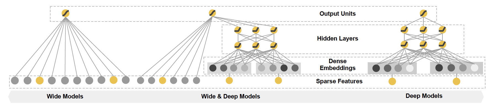

# Wide&&Deep Practice
用keras写的Google Wide&&Deep model
<h3 align="center"> 模型结构图</h3>

    

数据源:

[Adult Data Set](https://archive.ics.uci.edu/ml/datasets/adult) 
Abstract: Predict whether income exceeds $50K/yr based on census data. Also known as "Census Income" dataset.

依赖：
- numpy
- pandas
- sklearn
- keras==2.0.4
