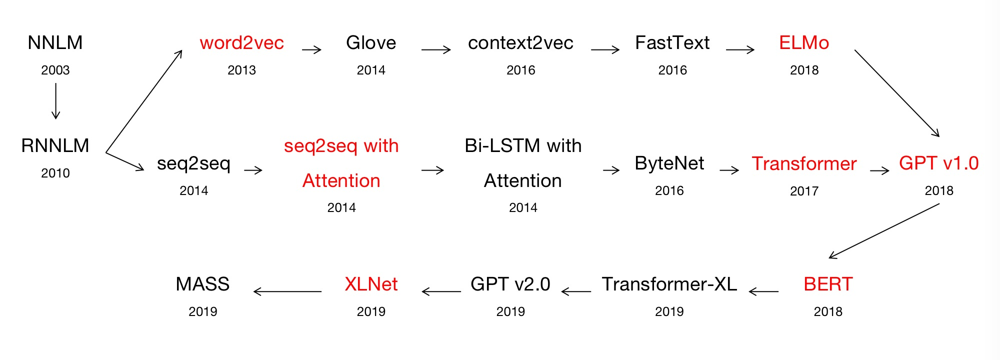

# AIPractice

    

# StatisticalLearning
| # | Title | Category | Basic Implementation | Basic Project |Diffculty|
|:---:| :-----: | :---------:| :-----------:| :---------:| :--------------------: | 
| 1 | Perceptron | SupervisedLearning Classfication|[PerceptronFromScratch](https://github.com/WatsonWangZh/MachineLearningPractice/blob/master/StatisticalLearning/Perceptron/Algothrim/PerceptronFromScratch.py) [PerceptronFromSklearn](https://github.com/WatsonWangZh/MachineLearningPractice/blob/master/StatisticalLearning/Perceptron/Algothrim/PerceptronFromSklearn.py) | [PerceptronOnIrisDataSet](https://github.com/WatsonWangZh/MachineLearningPractice/blob/master/StatisticalLearning/Perceptron/Project/Code/PerceptronOnIrisDataSet.py) | Easy | 
| 2 | KNN | SupervisedLearning Classfication&Regression | [KNNFromScratch](https://github.com/WatsonWangZh/MachineLearningPractice/blob/master/StatisticalLearning/KNN/Algothrim/KNNFromScratch.py) [KNNFromSklearn](https://github.com/WatsonWangZh/MachineLearningPractice/blob/master/StatisticalLearning/KNN/Algothrim/KNNFromSklearn.py) | [约会网站配对](https://github.com/WatsonWangZh/MachineLearningPractice/blob/master/StatisticalLearning/KNN/Project/Code/%E7%BA%A6%E4%BC%9A%E7%BD%91%E7%AB%99%E9%85%8D%E5%AF%B9.ipynb) [手写识别系统](https://github.com/WatsonWangZh/MachineLearningPractice/blob/master/StatisticalLearning/KNN/Project/Code/%E6%89%8B%E5%86%99%E8%AF%86%E5%88%AB%E7%B3%BB%E7%BB%9F.ipynb) [KNNOnLetterRecognitionDatasets](https://github.com/WatsonWangZh/MachineLearningPractice/blob/master/StatisticalLearning/KNN/Project/Code/KNNOnLetterRecognitionDatasets.py) | Easy | 
| 3 | DecisionTree | SupervisedLearning Classfication&Regression |[DecisionTreeFromScratch](https://github.com/WatsonWangZh/MachineLearningPractice/blob/master/StatisticalLearning/DecisionTree/Algothrim/DecisionTreeFromScratch.py) [DecisionTreeFromSklearn](https://github.com/WatsonWangZh/MachineLearningPractice/blob/master/StatisticalLearning/DecisionTree/Algothrim/DecisionTreeFromSklearn.py) | [使用决策树预测眼镜类型](https://github.com/WatsonWangZh/MachineLearningPractice/blob/master/StatisticalLearning/DecisionTree/Project/Code/%E4%BD%BF%E7%94%A8%E5%86%B3%E7%AD%96%E6%A0%91%E9%A2%84%E6%B5%8B%E9%9A%90%E5%BD%A2%E7%9C%BC%E9%95%9C%E7%B1%BB%E5%9E%8B.ipynb) [DTOnPageBlocksClassificationDataSet](https://github.com/WatsonWangZh/MachineLearningPractice/blob/master/StatisticalLearning/DecisionTree/Project/Code/DTOnPageBlocksClassificationDataSet.py)  | Easy | 
| 4 | NaiveBayes | SupervisedLearning Classfication | [NaiveBayesFromScratch](https://github.com/WatsonWangZh/MachineLearningPractice/blob/master/StatisticalLearning/NaiveBayes/Algothrim/NaiveBayesFromScratch.py) [NaiveBayesFromSklearn](https://github.com/WatsonWangZh/MachineLearningPractice/blob/master/StatisticalLearning/NaiveBayes/Algothrim/NaiveBayesFromSklearn.py) | [使用朴素贝叶斯过滤垃圾邮件](https://github.com/WatsonWangZh/MachineLearningPractice/blob/master/StatisticalLearning/NaiveBayes/Project/Code/%E4%BD%BF%E7%94%A8%E6%9C%B4%E7%B4%A0%E8%B4%9D%E5%8F%B6%E6%96%AF%E8%BF%87%E6%BB%A4%E5%9E%83%E5%9C%BE%E9%82%AE%E4%BB%B6.ipynb) [NaiveBayesOnNurseryDataSet](https://github.com/WatsonWangZh/MachineLearningPractice/blob/master/StatisticalLearning/NaiveBayes/Project/Code/NaiveBayesOnNurseryDataSet.py)  | Easy | 
| 5 | LogisticRegression | SupervisedLearning Classfication | [LogisticRegressionFromScratch(FullGrad)]()  [LogisticRegressionFromScratch(SGD)]() [LogisticRegressionFromSklearn]() |  | Easy | 

# DeepLearning
| # | Title | Category | Difficulty | Solution | Some Notes |
|:---:| :-----: | :---------:| :-----------:| :---------:| :--------------------: |
| 1 | 第一个聊天机器人Eliza | NLP ChatBot | Easy | [Eliza](https://github.com/WatsonWangZh/MachineLearningPractice/blob/master/DeepLearning/NaturalLanguageProcess/ChatBot_Eliza/eliza.py) |  |
| 2 | Gridworld | ReinforcementLearning Q-Learing | Easy | [Gridworld](https://github.com/WatsonWangZh/MachineLearningPractice/blob/master/DeepLearning/ReinforcementLearning/GridWorld/) | 入门 |
| 3 | Wide&&Deep Practice | General LogisticRegression DNN | Medium | [Wide&&DeepPractice](https://github.com/WatsonWangZh/MachineLearningPractice/blob/master/DeepLearning/General/WideAndDeepPractice/) | CTR 推荐 |
| 4 | MachineTranslation | NLP MachineTranslation | Medium | [StatisticalMachineTranslation](https://github.com/WatsonWangZh/MachineLearningPractice/blob/master/DeepLearning/NaturalLanguageProcess/MachineTranslation/StatisticalMachineTranslation/)| 统计机器翻译基本思路 |
| 5 | TensorFlowPractice | General TensorFlowPractice | Easy | [Linear_Regression](https://github.com/WatsonWangZh/MachineLearningPractice/blob/master/DeepLearning/General/TensorflowPractice/Linear_Regression.py) [Polynomial_Regression](https://github.com/WatsonWangZh/MachineLearningPractice/blob/master/DeepLearning/General/TensorflowPractice/Polynomial_Regression.py) [Logistic_Regression](https://github.com/WatsonWangZh/MachineLearningPractice/blob/master/DeepLearning/General/TensorflowPractice/Logistic_Regression.py) [MLP_DNN](https://github.com/WatsonWangZh/MachineLearningPractice/blob/master/DeepLearning/General/TensorflowPractice/Multilayer_Perceptron.py)| X Regression with TensorBoard |
| 6 | GeneralNER | NLP NER | Medium | [GeneralNER](https://github.com/WatsonWangZh/MachineLearningPractice/blob/master/DeepLearning/NaturalLanguageProcess/GeneralNER/)| GeneralNER in BiLSTM + CRF with Keras |

# Paper Reading with Code

## Text Embedding
| # | Title | KeyPoints | Conference/Publication | Implementation | Notes|
|:---:| :-----: | :---------:| :-----------:| :---------:| :--------------------: |
| 1 | [Efficient Estimation of Word Representations in Vector Space](https://arxiv.org/pdf/1301.3781.pdf)

Abstract
We propose two novel model architectures for computing continuous vector representations of words from very large data sets. The quality of these representations is measured in a word similarity task, and the results are compared to the previously best performing techniques based on different types of neural networks. We observe large improvements in accuracy at much lower computational cost, i.e. it takes less than a day to learn high quality word vectors from a 1.6 billion words data set. Furthermore, we show that these vectors provide state-of-the-art performance on our test set for measuring syntactic and semantic word similarities.
|WordEmbedding Word2vec 

Summary
静态WordEmbedding CBOW SkipGram WordEmbedding是主产品 无法区分多义词的不同语义
| Computation and Language, 2013. | [TensorFlow]() [Pytorch]() | [Note]()  |
| 2 | [GloVe: Global Vectors for Word Representation](https://www.aclweb.org/anthology/D14-1162)

Abstract
Recent methods for learning vector spacerepresentations  of  words  have  succeededin   capturing   fine-grained   semantic   andsyntactic  regularities  using  vector  arith-metic,  but the origin of these regularitieshas  remained  opaque. We  analyze  andmake explicit the model properties neededfor  such  regularities  to  emerge  in  wordvectors.   The  result  is  a  new  global  log-bilinear  regression  model  that  combinesthe  advantages  of  the  two  major  modelfamilies  in  the  literature:   global  matrixfactorization  and  local  context  windowmethods.  Our model efficiently leveragesstatistical information by training only onthe nonzero elements in a word-word co-occurrence matrix, rather than on the en-tire sparse matrix or on individual contextwindows in a large corpus. The model pro-duces a vector space with meaningful sub-structure, as evidenced by its performanceof 75% on a recent word analogy task.  Italso outperforms related models on simi-larity tasks and named entity recognition. 
 |WordEmbedding GloVe| EMNLP 2014 | [TensorFlow]() [Pytorch]() | [Note]()  |
| 3 | [Skip-Thought Vectors](https://papers.nips.cc/paper/5950-skip-thought-vectors.pdf)

Abstract
We propose two novel model architectures for computing continuous vector representations of words from very large data sets. The quality of these representations is measured in a word similarity task, and the results are compared to the previously best performing techniques based on different types of neural networks. We observe large improvements in accuracy at much lower computational cost, i.e. it takes less than a day to learn high quality word vectors from a 1.6 billion words data set. Furthermore, we show that these vectors provide state-of-the-art performance on our test set for measuring syntactic and semantic word similarities.
 |SentenceEmbedding Skip-Thought| NIPS 2015 | [TensorFlow]() [Pytorch]() | [Note]()  |
| 4 | [An efficient framework for learning sentence representations](https://arxiv.org/pdf/1803.02893.pdf)

Abstract
In this work we propose a simple and efficient framework for learning sentence representations from unlabelled data. Drawing inspiration from the distributional hypothesis and recent work on learning sentence representations, we reformulate the problem of predicting the context in which a sentence appears as a classification problem. Given a sentence and its context, a classifier distinguishes context sentences from other contrastive sentences based on their vector representations. This allows us to efficiently learn different types of encoding functions, and we show that the model learns high-quality sentence representations. We demonstrate that our sentence representations outperform state-of-the-art unsupervised and supervised representation learning methods on several downstream NLP tasks that involve understanding sentence semantics while achieving an order of magnitude speedup in training time.
 |SentenceEmbedding Quick-Thought| ICLR 2018 | [TensorFlow]() [Pytorch]() | [Note]()  |
| 5 | [context2vec:Learning Generic Context Embedding with Bidirectional LSTM](https://www.aclweb.org/anthology/K16-1006)

Abstract
Context representations are central to various NLP tasks, such as word sense disambiguation, named entity recognition, coreference resolution, and many more. In this work we present a neural model for efficiently learning a generic context embedding function from large corpora, using bidirectional LST. With a very simple application of our context representations, we manage to surpass or nearly reach state-of-the-art results on sentence completion, lexical substitution and word sense disambiguation tasks, while substantially outperforming the popular context representation of averaged word embeddings. We release our code and pretrained models, suggesting they could be useful in a wide variety of NLP tasks.
 |ContextEmbedding Context2Vec| CoNLL 2016 | [TensorFlow]() [Pytorch]() | [Note]()  |
| 6 | [Distributed Representations of Sentences and Documents](https://arxiv.org/pdf/1405.4053.pdf)

Abstract
Many machine learning algorithms require the input to be represented as a fixed-length feature vector. When it comes to texts, one of the most common fixed-length features is bag-of-words. Despite their popularity, bag-of-words features have two major weaknesses: they lose the ordering of the words and they also ignore semantics of the words. For example, "powerful," "strong" and "Paris" are equally distant. In this paper, we propose Paragraph Vector, an unsupervised algorithm that learns fixed-length feature representations from variable-length pieces of texts, such as sentences, paragraphs, and documents. Our algorithm represents each document by a dense vector which is trained to predict words in the document. Its construction gives our algorithm the potential to overcome the weaknesses of bag-of-words models. Empirical results show that Paragraph Vectors outperform bag-of-words models as well as other techniques for text representations. Finally, we achieve new state-of-the-art results on several text classification and sentiment analysis tasks.
 |SentenceEmbedding DocumentEmbedding Doc2Vec| Computation and Language, 2014. | [TensorFlow]() [Pytorch]() | [Note]()  |

## Graph Embedding
| # | Title | KeyPoints | Conference/Publication | Implementation | Notes|
|:---:| :-----: | :---------:| :-----------:| :---------:| :--------------------: |
| 1 | TransE |Translation|  | [TensorFlow]() [Pytorch]() | [Note]()  |
| 2 | DeepWalk |word2vec|  | [TensorFlow]() [Pytorch]() | [Note]()  |
| 3 | Node2Vec |word2vec|  | [TensorFlow]() [Pytorch]() | [Note]()  |
| 4 | LINE |TODO|  | [TensorFlow]() [Pytorch]() | [Note]()  |

## Pre-trained Language Model

    

| # | Title | KeyPoints | Conference/Publication | Implementation | Notes|
|:---:| :-----: | :---------:| :-----------:| :---------:| :--------------------: |
| 1 | [A Neural Probabilistic Language Model](http://www.jmlr.org/papers/volume3/bengio03a/bengio03a.pdf)

Abstract
A goal of statistical language modeling is to learn the joint probability function of sequences of words in a language. This is intrinsically difficult because of the curse of dimensionality: a word sequence on which the model will be tested is likely to be different from all the word sequences seen during training. Traditional but very successful approaches based on n-grams obtain generalization by concatenating very short overlapping sequences seen in the training set. We propose to fight the curse of dimensionality by learning a distributed representation for words which allows each training sentence to inform the model about an exponential number of semantically neighboring sentences. The model learns simultaneously (1) a distributed representation for each word along with (2) the probability function for word sequences, expressed in terms of these representations. Generalization is obtained because a sequence of words that has never been seen before gets high probability if it is made of words that are similar (in the sense of having a nearby representation) to words forming an already seen sentence. Training such large models (with millions of parameters) within a reasonable time is itself a significant challenge. We report on experiments using neural networks for the probability function, showing on two text corpora that the proposed approach significantly improves on state-of-the-art n-gram models, and that the proposed approach allows to take advantage of longer contexts.
 |NNLM 

Summary
静态WordEmbedding 给定上文单词 预测当前单词 WordEmbedding是副产品
| JMLR 2003 | [TensorFlow]() [Pytorch]() | [Note]()  |
| 2 | [Recurrent neural network based language model](https://www.fit.vutbr.cz/research/groups/speech/publi/2010/mikolov_interspeech2010_IS100722.pdf) [Slides](http://www.fit.vutbr.cz/research/groups/speech/servite/2010/rnnlm_mikolov.pdf)

Abstract
A new recurrent neural network based language model (RNN LM) with applications to speech recognition is presented. Results indicate that it is possible to obtain around 50% reduction of perplexity by using mixture of several RNN LMs, compared to a state of the art backoff language model. Speech recognition experiments show around 18% reduction of word error rate on the Wall Street Journal task when comparing models trained on the same amount of data, and around 5% on the much harder NIST RT05 task, even when the backoff model is trained on much more data than the RNN LM. We provide ample empirical evidence to suggest that connectionist language models are superior to standard n-gram techniques, except their high computational (training) complexity.
 |Neural language modeling RNNLM| INTERSPEECH 2010 | [TensorFlow]() [Pytorch]() | [Note]()  |
|  | [Deep contextualized word representations](https://arxiv.org/pdf/1802.05365.pdf)

Abstract
We introduce a new type of deep contextualized word representation that models both (1) complex characteristics of word use (e.g., syntax and semantics), and (2) how these uses vary across linguistic contexts (i.e., to model polysemy). Our word vectors are learned functions of the internal states of a deep bidirectional language model (biLM), which is pre-trained on a large text corpus. We show that these representations can be easily added to existing models and significantly improve the state of the art across six challenging NLP problems, including question answering, textual entailment and sentiment analysis. We also present an analysis showing that exposing the deep internals of the pre-trained network is crucial, allowing downstream models to mix different types of semi-supervision signals.
 |Neural language modeling ELMO| NAACL 2018 | [TensorFlow]() [Pytorch]() | [Note]()  |
| 3 | [Improving Language Understanding by Generative Pre-Training](https://s3-us-west-2.amazonaws.com/openai-assets/research-covers/language-unsupervised/language_understanding_paper.pdf)

Abstract
Natural language understanding comprises a wide range of diverse tasks such as textual entailment, question answering, semantic similarity assessment, and document classification. Although large unlabeled text corpora are abundant, labeled data for learning these specific tasks is scarce, making it challenging for discriminatively trained models to perform adequately. We demonstrate that large gains on these tasks can be realized by generative pre-training of a language model on a diverse corpus of unlabeled text, followed by discriminative fine-tuning on each specific task. In contrast to previous approaches, we make use of task-aware input transformations during fine-tuning to achieve effective transfer while requiring minimal changes to the model architecture. We demonstrate the effectiveness of our approach on a wide range of benchmarks for natural language understanding. Our general task-agnostic model outperforms discriminatively trained models that use architectures specifically crafted for each task, significantly improving upon the state of the art in 9 out of the 12 tasks studied. For instance, we achieve absolute improvements of 8.9% on commonsense reasoning (Stories Cloze Test), 5.7% on question answering (RACE), and 1.5% on textual entailment (MultiNLI).
 |GPT v1.0

Summary
基于Fine-Tuning的预训练方法 与word2vec不同点在于：word2vec在fine-tuning过程中，只调整embedding矩阵而不调整网络结构，而GPT的网络结构参数也参与到Fine-Tuning过程中 典型的两阶段过程 第一阶段利用语言模型进行预训练,第二阶段通过Fine-Tuning的模式解决下游任务 特征抽取器采用Transformer 仅采用单向的语言模型 GPT的使用: 需要将下游任务的网络结构改造成与GPT网络结构相同，然后使用预训练的参数初始化网络，并结合下游任务进行Fine-Tuing,以使得网络结构更加适合下游任务 finetuning时，通常在其后加入一个线性层，而不再接入复杂的网络
| INTERSPEECH 2018 | [TensorFlow]() [Pytorch]() | [Note]()  |
| 4 | [BERT: Pre-training of Deep Bidirectional Transformers for Language Understanding](https://arxiv.org/pdf/1810.04805.pdf)

Abstract
We introduce a new language representation model called BERT, which stands for Bidirectional Encoder Representations from Transformers. Unlike recent language representation models, BERT is designed to pre-train deep bidirectional representations from unlabeled text by jointly conditioning on both left and right context in all layers. As a result, the pre-trained BERT model can be fine-tuned with just one additional output layer to create state-of-the-art models for a wide range of tasks, such as question answering and language inference, without substantial task-specific architecture modifications. BERT is conceptually simple and empirically powerful. It obtains new state-of-the-art results on eleven natural language processing tasks, including pushing the GLUE score to 80.5% (7.7% point absolute improvement), MultiNLI accuracy to 86.7% (4.6% absolute improvement), SQuAD v1.1 question answering Test F1 to 93.2 (1.5 point absolute improvement) and SQuAD v2.0 Test F1 to 83.1 (5.1 point absolute improvement).
 |BERT 

Summary
BERT(Bidirectional Encode Representations from Transformer)最关键有两点:特征抽取器采用Transformer;采用双向语言模型进行预训练 BERT与GPT及ELMO的对比:如果把ELMO的特征抽取器换成Transformer，那么就得到了BERT;如果把GPT的预训练阶段换成双向语言模型，就得到了BERT。
| INTERSPEECH 2018 | [TensorFlow]() [Pytorch]() | [Note]()  |
| 5 | [Transformer-XL: Attentive Language Models Beyond a Fixed-Length Context](https://arxiv.org/pdf/1901.02860.pdf)

Abstract
Transformers have a potential of learning longer-term dependency, but are limited by a fixed-length context in the setting of language modeling. We propose a novel neural architecture Transformer-XL that enables learning dependency beyond a fixed length without disrupting temporal coherence. It consists of a segment-level recurrence mechanism and a novel positional encoding scheme. Our method not only enables capturing longer-term dependency, but also resolves the context fragmentation problem. As a result, TransformerXL learns dependency that is 80% longer than RNNs and 450% longer than vanilla Transformers, achieves better performance on both short and long sequences, and is up to 1,800+ times faster than vanilla Transformers during evaluation. Notably, we improve the state-ofthe-art results of bpc/perplexity to 0.99 on enwiki8, 1.08 on text8, 18.3 on WikiText-103, 21.8 on One Billion Word, and 54.5 on Penn Treebank (without finetuning). When trained only on WikiText-103, Transformer-XL manages to generate reasonably coherent, novel text articles with thousands of tokens. Our code, pretrained models, and hyperparameters are available in both Tensorflow and PyTorch1.
 |Transformer-XL| ACL 2019 | [TensorFlow]() [Pytorch]() | [Note]()  |
| 6 | [Language Models are Unsupervised Multitask Learners](https://d4mucfpksywv.cloudfront.net/better-language-models/language-models.pdf) [Slides](https://pdfs.semanticscholar.org/41f9/45f59bd0d345d4e355fb72110524f6fdffdb.pdf)

Abstract
Natural language processing tasks, such as question answering, machine translation, reading comprehension, and summarization, are typically approached with supervised learning on taskspecific datasets. We demonstrate that language models begin to learn these tasks without any explicit supervision when trained on a new dataset of millions of webpages called WebText. When conditioned on a document plus questions, the answers generated by the language model reach 55 F1 on the CoQA dataset - matching or exceeding the performance of 3 out of 4 baseline systems without using the 127,000+ training examples. The capacity of the language model is essential to the success of zero-shot task transfer and increasing it improves performance in a log-linear fashion across tasks. Our largest model, GPT-2, is a 1.5B parameter Transformer that achieves state of the art results on 7 out of 8 tested language modeling datasets in a zero-shot setting but still underfits WebText. Samples from the model reflect these improvements and contain coherent paragraphs of text. These findings suggest a promising path towards building language processing systems which learn to perform tasks from their naturally occurring demonstrations.
 |GPT v2.0| OpenAI Blog 2019 | [TensorFlow]() [Pytorch]() | [Note]()  |
| 7 | [ERNIE: Enhanced Language Representation with Informative Entities](https://arxiv.org/pdf/1905.07129.pdf)

Abstract
Neural language representation models such as BERT pre-trained on large-scale corpora can well capture rich semantic patterns from plain text, and be fine-tuned to consistently improve the performance of various NLP tasks. However, the existing pre-trained language models rarely consider incorporating knowledge graphs (KGs), which can provide rich structured knowledge facts for better language understanding. We argue that informative entities in KGs can enhance language representation with external knowledge. In this paper, we utilize both large-scale textual corpora and KGs to train an enhanced language representation model (ERNIE), which can take full advantage of lexical, syntactic, and knowledge information simultaneously. The experimental results have demonstrated that ERNIE achieves significant improvements on various knowledge-driven tasks, and meanwhile is comparable with the state-of-the-art model BERT on other common NLP tasks. The source code and experiment details of this paper can be obtained from https://github.com/thunlp/ERNIE.
 |Tsinghua ERNIE| ACL 2019 | [TensorFlow]() [Pytorch]() | [Note]()  |
| 8 | [ERNIE: Enhanced Representation through Knowledge Integration](https://arxiv.org/pdf/1904.09223.pdf)

Abstract
We present a novel language representation model enhanced by knowledge called ERNIE (Enhanced Representation through kNowledge IntEgration). Inspired by the masking strategy of BERT (Devlin et al., 2018), ERNIE is designed to learn language representation enhanced by knowledge masking strategies, which includes entity-level masking and phrase-level masking. Entity-level strategy masks entities which are usually composed of multiple words. Phrase-level strategy masks the whole phrase which is composed of several words standing together as a conceptual unit. Experimental results show that ERNIE outperforms other baseline methods, achieving new state-of-the-art results on five Chinese natural language processing tasks including natural language inference, semantic similarity, named entity recognition, sentiment analysis and question answering. We also demonstrate that ERNIE has more powerful knowledge inference capacity on a cloze test.
 |Baidu ERNIE| arXiv 2019 | [TensorFlow]() [Pytorch]() | [Note]()  |
|  | [ERNIE 2.0: A Continual Pre-training Framework for Language Understanding](https://arxiv.org/pdf/1907.12412.pdf)

Abstract
Recently, pre-trained models have achieved state-of-the-art results in various language understanding tasks, which indicates that pre-training on large-scale corpora may play a crucial role in natural language processing. Current pre-training procedures usually focus on training the model with several simple tasks to grasp the co-occurrence of words or sentences. However, besides co-occurring, there exists other valuable lexical, syntactic and semantic information in training corpora, such as named entity, semantic closeness and discourse relations. In order to extract to the fullest extent, the lexical, syntactic and semantic information from training corpora, we propose a continual pre-training framework named ERNIE 2.0 which builds and learns incrementally pre-training tasks through constant multi-task learning. Experimental results demonstrate that ERNIE 2.0 outperforms BERT and XLNet on 16 tasks including English tasks on GLUE benchmarks and several common tasks in Chinese. The source codes and pre-trained models have been released at this https URL.
 |Baidu ERNIE 2.0| arXiv 2019 | [TensorFlow]() [Pytorch]() | [Note]()  |
| 9 | [MASS: Masked Sequence to Sequence Pre-training for Language Generation](https://arxiv.org/pdf/1905.02450.pdf)

Abstract
Pre-training and fine-tuning, e.g., BERT (Devlin et al., 2018), have achieved great success in language understanding by transferring knowledge from rich-resource pre-training task to the low/zero-resource downstream tasks. Inspired by the success of BERT, we propose MAsked Sequence to Sequence pre-training (MASS) for encoder-decoder based language generation. MASS adopts the encoder-decoder framework to reconstruct a sentence fragment given the remaining part of the sentence: its encoder takes a sentence with randomly masked fragment (several consecutive tokens) as input, and its decoder tries to predict this masked fragment. In this way, MASS can jointly train the encoder and decoder to develop the capability of representation extraction and language modeling. By further fine-tuning on a variety of zero/low-resource language generation tasks, including neural machine translation, text summarization and conversational response generation (3 tasks and totally 8 datasets), MASS achieves significant improvements over baselines without pre-training or with other pretraining methods. Specially, we achieve state-ofthe-art accuracy (37.5 in terms of BLEU score) on the unsupervised English-French translation, even beating the early attention-based supervised model (Bahdanau et al., 2015b).
 |MASS| ICLR  2019 | [Pytorch](https://github.com/microsoft/MASS) | [Note]()  |
|  | [Unified Language Model Pre-training for Natural Language Understanding and Generation](https://arxiv.org/pdf/1905.03197.pdf)

Abstract
This paper presents a new Unified pre-trained Language Model (UniLM) that can be fine-tuned for both natural language understanding and generation tasks. The model is pre-trained using three types of language modeling tasks: unidirectional, bidirectional, and sequence-to-sequence prediction. The unified modeling is achieved by employing a shared Transformer network and utilizing specific self-attention masks to control what context the prediction conditions on. UniLM compares favorably with BERT on the GLUE benchmark, and the SQuAD 2.0 and CoQA question answering tasks. Moreover, UniLM achieves new state-of-the-art results on five natural language generation datasets, including improving the CNN/DailyMail abstractive summarization ROUGE-L to 40.51 (2.04 absolute improvement), the Gigaword abstractive summarization ROUGE-L to 35.75 (0.86 absolute improvement), the CoQA generative question answering F1 score to 82.5 (37.1 absolute improvement), the SQuAD question generation BLEU-4 to 22.12 (3.75 absolute improvement), and the DSTC7 document-grounded dialog response generation NIST-4 to 2.67 (human performance is 2.65). The code and pre-trained models are available at this https URL.
 |UniLM| NIPS 2019 | [Pytorch](https://github.com/microsoft/unilm) | [Note]()  |
| 10 | [XLNet: Generalized Autoregressive Pretraining for Language Understanding](https://arxiv.org/pdf/1906.08237.pdf)

Abstract
With the capability of modeling bidirectional contexts, denoising autoencoding based pretraining like BERT achieves better performance than pretraining approaches based on autoregressive language modeling. However, relying on corrupting the input with masks, BERT neglects dependency between the masked positions and suffers from a pretrain-finetune discrepancy. In light of these pros and cons, we propose XLNet, a generalized autoregressive pretraining method that (1) enables learning bidirectional contexts by maximizing the expected likelihood over all permutations of the factorization order and (2) overcomes the limitations of BERT thanks to its autoregressive formulation. Furthermore, XLNet integrates ideas from Transformer-XL, the state-of-the-art autoregressive model, into pretraining. Empirically, XLNet outperforms BERT on 20 tasks, often by a large margin, and achieves state-of-the-art results on 18 tasks including question answering, natural language inference, sentiment analysis, and document ranking.1.
 |XLNet| ICLR  2019 | [TensorFlow]() [Pytorch]() | [Note]()  |
| 11 | [ALBERT: A LITE BERT FOR SELF-SUPERVISED LEARNING OF LANGUAGE REPRESENTATIONS](https://arxiv.org/pdf/1909.11942.pdf)

Abstract
Increasing model size when pretraining natural language representations often results in improved performance on downstream tasks. However, at some point further model increases become harder due to GPU/TPU memory limitations, longer training times, and unexpected model degradation. To address these problems, we present two parameter-reduction techniques to lower memory consumption and increase the training speed of BERT (Devlin et al., 2019). Comprehensive empirical evidence shows that our proposed methods lead to models that scale much better compared to the original BERT. We also use a self-supervised loss that focuses on modeling inter-sentence coherence, and show it consistently helps downstream tasks with multi-sentence inputs. As a result, our best model establishes new state-of-the-art results on the GLUE, RACE, and SQuAD benchmarks while having fewer parameters compared to BERT-large.
 |ALBERT| ICLR  2020 | [TensorFlow](https://github.com/google-research/ALBERT)| [Note]()  |

# Sequences Labeling
| # | Title | KeyPoints | Conference/Publication | Implementation | Notes|
|:---:| :-----: | :---------:| :-----------:| :---------:| :--------------------: |
| 1 | [End-to-end Sequence Labeling via Bi-directional LSTM-CNNs-CRF](https://arxiv.org/pdf/1603.01354.pdf)

Abstract
State-of-the-art sequence labeling systems traditionally require large amounts of task-specific knowledge in the form of hand-crafted features and data pre-processing. In this paper, we introduce a novel neutral network architecture that benefits from both word- and character-level representations automatically, by using combination of bidirectional LSTM, CNN and CRF. Our system is truly end-to-end, requiring no feature engineering or data pre-processing, thus making it applicable to a wide range of sequence labeling tasks. We evaluate our system on two data sets for two sequence labeling tasks --- Penn Treebank WSJ corpus for part-of-speech (POS) tagging and CoNLL 2003 corpus for named entity recognition (NER). We obtain state-of-the-art performance on both the two data --- 97.55\% accuracy for POS tagging and 91.21\% F1 for NER.
|E2ECRF| ACL 2016 | [TensorFlow]() [Pytorch]() | [Note]()  |
| 2 | [Chinese NER Using Lattice LSTM](https://www.aclweb.org/anthology/P18-1144)

Abstract
We investigate a lattice-structured LSTM model for Chinese NER, which encodes a sequence of input characters as well as all potential words that match a lexicon. Compared with character-based methods, our model explicitly leverages word and word sequence information. Compared with word-based methods, lattice LSTM does not suffer from segmentation errors. Gated recurrent cells allow our model to choose the most relevant characters and words from a sentence for better NER results. Experiments on various datasets show that lattice LSTM outperforms both word-based and character-based LSTM baselines, achieving the best results. 
 |Lattic LSTM| ACL 2018 | [TensorFlow]() [Pytorch]() | [Note]()  |

## Text Classification
| # | Title | KeyPoints | Conference/Publication | Implementation | Notes|
|:---:| :-----: | :---------:| :-----------:| :---------:| :--------------------: |
| 1 | [Bag of Tricks for Efficient Text Classification](https://arxiv.org/pdf/1607.01759.pdf)

Abstract
This paper explores a simple and efficient baseline for text classification. Our experiments show that our fast text classifier fastText is often on par with deep learning classifiers in terms of accuracy, and many orders of magnitude faster for training and evaluation. We can train fastText on more than one billion words in less than ten minutes using a standard multicore CPU, and classify half a million sentences among 312K classes in less than a minute.
|FastText| EACL 2017 | [TensorFlow]() [Pytorch]() | [Note]()  |
| 2 | [Hierarchical Attention Networks for Document Classification](https://www.cs.cmu.edu/~./hovy/papers/16HLT-hierarchical-attention-networks.pdf)

Abstract
We propose a hierarchical attention network for document classification. Our model has two distinctive characteristics: (i) it has a hierarchical structure that mirrors the hierarchical structure of documents; (ii) it has two levels of attention mechanisms applied at the wordand sentence-level, enabling it to attend differentially to more and less important content when constructing the document representation. Experiments conducted on six large scale text classification tasks demonstrate that the proposed architecture outperform previous methods by a substantial margin. Visualization of the attention layers illustrates that the model selects qualitatively informative words and sentences.
 | Hierarchical Attention| ACL 2016 | [TensorFlow]() [Pytorch]() | [Note]()  |

## Graph Neural Network
| # | Title | Category | Difficulty | Solution | Basic idea(One line) |
|:---:| :-----: | :---------:| :-----------:| :---------:| :--------------------: |
| 1 | [Graph Neural Networks: A Review of Methods and Applications](https://arxiv.org/pdf/1812.08434.pdf)

Abstract
Lots of learning tasks require dealing with graph data which contains rich relation information among elements. Modeling physics system, learning molecular fingerprints, predicting protein interface, and classifying diseases require a model to learn from graph inputs. In other domains such as learning from non-structural data like texts and images, reasoning on extracted structures, like the dependency tree of sentences and the scene graph of images, is an important research topic which also needs graph reasoning models. Graph neural networks (GNNs) are connectionist models that capture the dependence of graphs via message passing between the nodes of graphs. Unlike standard neural networks, graph neural networks retain a state that can represent information from its neighborhood with arbitrary depth. Although the primitive GNNs have been found difficult to train for a fixed point, recent advances in network architectures, optimization techniques, and parallel computation have enabled successful learning with them. In recent years, systems based on variants of graph neural networks such as graph convolutional network (GCN), graph attention network (GAT), gated graph neural network (GGNN) have demonstrated ground-breaking performance on many tasks mentioned above. In this survey, we provide a detailed review over existing graph neural network models, systematically categorize the applications, and propose four open problems for future research.
 |Review Graph Neural Network| Machine Learning 2018 | No Code | [Note]()  |

# Competitions
| # | Title | Category | Difficulty | Solution | Some Notes |
|:---:| :-----: | :---------:| :-----------:| :---------:| :--------------------: |
| 1 | Feature_engineering_and_model_tuning | 特征工程 模型融合 | Medium | [Kaggle_Titanic]() [Kaggle-Bicycle-Example]() [Feature-engineering_and_Parameter_Tuning_XGBoost]()  |  |
| 2 | [天池新人实战赛o2o优惠券使用预测](.https://tianchi.aliyun.com/competition/entrance/231593/introduction) | 时间序列 模型练习 | Easy | [SGDClassifier](https://github.com/WatsonWangZh/MachineLearningPractice/blob/master/Competitions/%E5%A4%A9%E6%B1%A0%E6%96%B0%E4%BA%BA%E5%AE%9E%E6%88%98%E8%B5%9Bo2o%E4%BC%98%E6%83%A0%E5%88%B8%E4%BD%BF%E7%94%A8%E9%A2%84%E6%B5%8B/o2o-1.ipynb) [DecisionTreeClassifier](https://github.com/WatsonWangZh/MachineLearningPractice/blob/master/Competitions/%E5%A4%A9%E6%B1%A0%E6%96%B0%E4%BA%BA%E5%AE%9E%E6%88%98%E8%B5%9Bo2o%E4%BC%98%E6%83%A0%E5%88%B8%E4%BD%BF%E7%94%A8%E9%A2%84%E6%B5%8B/o2o-1-DecisionTree.ipynb) [NaiveBayesClassifier](https://github.com/WatsonWangZh/MachineLearningPractice/blob/master/Competitions/%E5%A4%A9%E6%B1%A0%E6%96%B0%E4%BA%BA%E5%AE%9E%E6%88%98%E8%B5%9Bo2o%E4%BC%98%E6%83%A0%E5%88%B8%E4%BD%BF%E7%94%A8%E9%A2%84%E6%B5%8B/o2o-1-NaiveBayes.ipynb)  |  |
